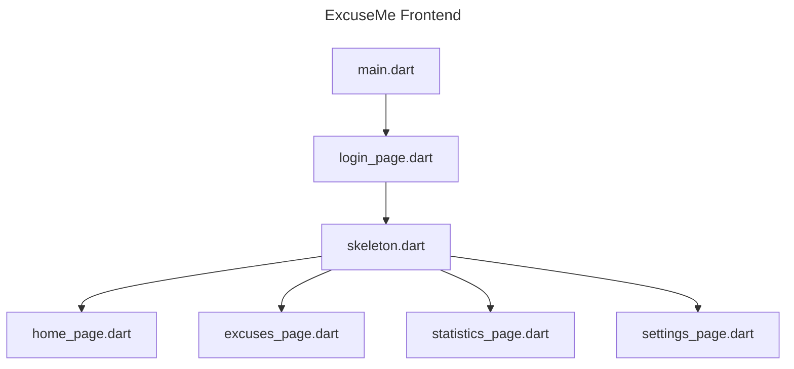

# excuseme

The ExcuseMe App 

# Dependencies

## Linux

First, get either `gnome-keyring` or `kwalletmanager`, depending desktop manager

```sh
#flutter_secure_storage
sudo apt install libsecret-1-dev clang lld llvm-18
```

# Icons

To generate app icons...

1. place the icon in `assets/`.
2. change the image path in pubspec.yaml (`flutter_launcher_icons`) 
3. run the following command

```sh
flutter pub run flutter_launcher_icons:main
```

# Flowchart

