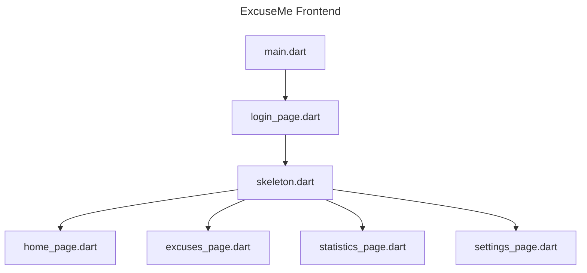

# excuseme

The ExcuseMe App 

# Dependencies

## Dotenv

Copy the example, and configure the dotenv.

`cp env.example .env`

## Linux

### flutter_secure_storage

Depending on your desktop manager, get `gnome-keyring` or `kwalletmanager` or any other credential manager suitable for flutter_secure_storage

```sh
sudo apt install libsecret-1-dev clang lld llvm-18
```

# Icons

To generate app icons...

1. place the icon in `assets/`.
2. change the image path in pubspec.yaml (`flutter_launcher_icons`) 
3. run the following command

```sh
flutter pub run flutter_launcher_icons:main
```

# Flowchart

